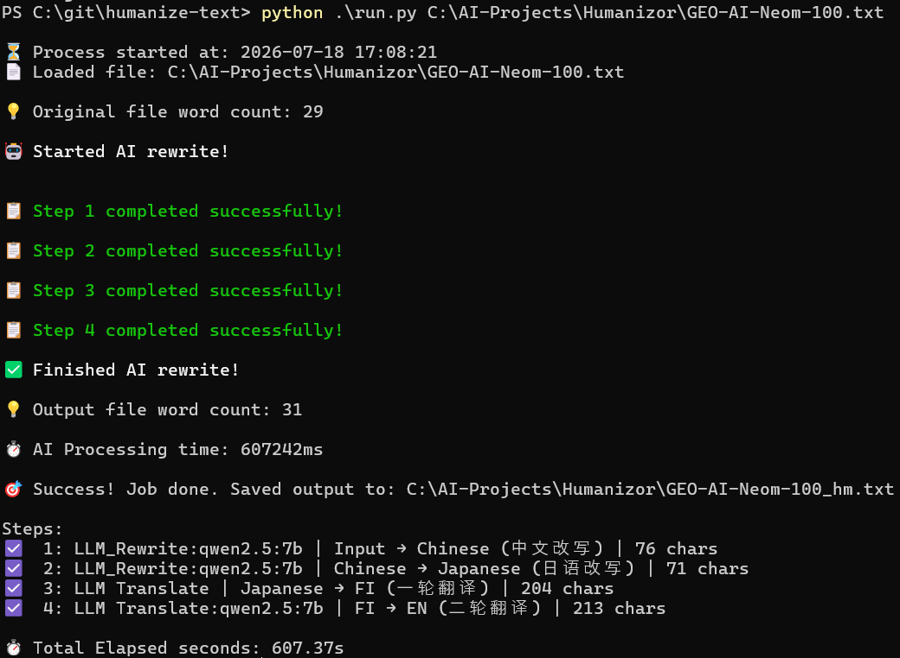
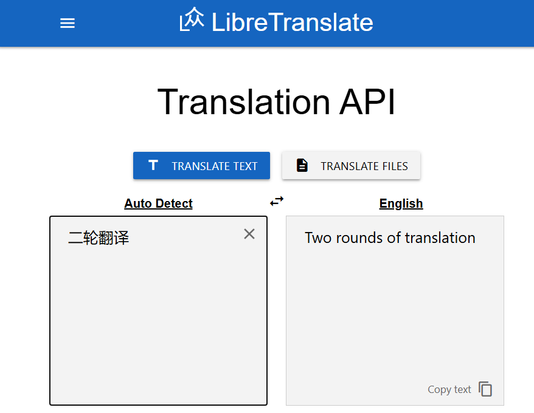
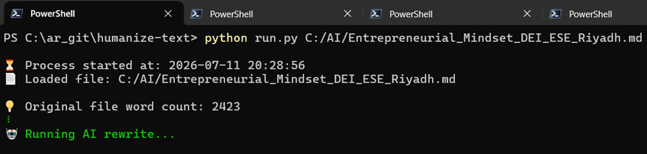

## Free Humanize Text: Open-source toolkit to rewrite AI-generated content into natural
<p align="center">
  
</p>

<p align="center">
  <a href="https://github.com/lynote-ai/humanize-text/stargazers"></a>
  <a href="https://github.com/lynote-ai/humanize-text/network/members"></a>
  <a href="https://github.com/lynote-ai/humanize-text/blob/main/LICENSE"></a>
  <a href="https://www.python.org/"></a>
  <a href="https://lynote.ai"></a>
</p>


---

## What is Humanize-Text?

An AI text humanization toolkit. This repo evolved through two stages:

- **v1.0** — Documented **4 humanization methodologies** as reference implementations (translation chain, multi-turn LLM rewriting, detection-guided feedback loop, mixed-engine translation). See [docs/techniques.md](docs/techniques.md).
- **v1.5 ** — Added the **Standard Pipeline**: a production-grade integration of Method 1 (Translation Chain) + Method 2 (LLM Rewriting), fixed as a 5-step chain we actually run and recommend.
- **v2.0 ** — Update the **Standard Pipeline**: a production-grade integration of Method 1 (Translation Chain) + Method 2 (LLM Rewriting), fixed as a 5-step chain we actually run and recommend.

### v2.0 — Standard Pipeline (Recommended offline setup)

The Standard Pipeline preserves the original writing style while routing text through a 4-step chain: two LLM humanization rewrites (Ollama local Qwen modles, OpenAI-compatible API) followed by two cross-engine translation hops.
```
Input (EN) → Chinese (LLM) → Japanese (LLM) → Finnish (LLM Translate) → English (LLM Translate)
```
Following major changes with this version

1. Fully offline with no inline API usage
2. Used Ollama local LLM for Rewrite and translate
3. Recomended to use Qwen 7b and 14b models



**Characteristics:**
- Best original style preservation among all approaches
- Fast processing speed
- 100% key information retention (verified on 50 text pairs)
- Expert quality score: 9.1/10

> The 4 underlying methodologies live in `src/methodologies/` as reference implementations for research and customization. The Standard Pipeline (`src/standard/pipeline.py`) is the recommended production path.

---

## How It Works

### Step-by-Step Pipeline

| Step | Engine         | From → To | Purpose |
|------|----------------|-----------|---------|
| 1 | LLM (temp 1.3) | Input → Chinese (Chinese Rewriting) | LLM humanization rewrite + language shift |
| 2 | LLM (temp 1.3) | Chinese → Japanese (Japanese Rewriting) | Second LLM humanization, carries Step 1 as history |
| 3 | LLM Translate  | Japanese → Finnish (First Round of Translation) | First translation hop — distant language structural disruption |
| 4 | LLM Translate  | Finnish → English (Second-Round Translation) | Second translation hop — cross-engine reconstruction |

### Why This Chain Works

1. **Steps 1–2 (LLM Rewrite):** Configurable LLM provider (Ollama Qwen default, OpenRouter optional) at temperature 1.3 rewrites while translating, breaking AI statistical fingerprints with creative variation. Step 2 carries Step 1 as conversation history for coherent humanization.
2. **Steps 3–4 (Multi-Engine Translation):** Two different NMT engines (Libre → LLM) introduce compounding structural changes. No single-engine fingerprint survives.
3. **Distant Languages:** Chinese → Japanese → Finnish maximizes linguistic distance at each hop, ensuring thorough restructuring before reconstruction to English.

---


## Quick Start

| Method | Who It's For | How |
|--------|-------------|-----|
| n8n Workflow | No-code automation users | Import [`n8n/humanize_standard.json`](n8n/humanize_standard.json) |
| Python Script | Developers | See below |

### Python

```bash
git clone https://github.com/alliraaza/humanize-text.git
cd humanize-text
pip install -r requirements.txt
#update config if required
vi config/config.toml
# Fill in your API keys in config.toml (see examples below)
python run.py AI_text_file.txt
```

Pre-requisits
1. Install and configure ollama

```aiignore
# Windows command
irm https://ollama.com/install.ps1 | iex
# Mac
curl -fsSL https://ollama.com/install.sh | sh
```
    
```
# configure the required model
# Create model file to change the ollama model configurations
    
    FROM qwen2.5:7b
    
    PARAMETER num_ctx 16384 
```
create and run customized model
```bash
    ollama create qwen2.5-16k:default -f .\ModelFileQ16
```
Ensure model is working 

```bash
PS C:\ar_git\humanize-text> ollama ps
NAME                   ID              SIZE      PROCESSOR    CONTEXT    UNTIL
qwen2.5-16k:default    0a89db422b31    5.9 GB    100% CPU     16384      2 minutes from now
```  
       
2. Install and configure Libre Translate (Optional if using Libre translate~~~~)
    ```
   # 1. Clone the repo
    git clone https://github.com/LibreTranslate/LibreTranslate.git
    cd LibreTranslate

    # Install dependencies
    pip install -r requirements.txt

    # If it says no requirements.txt, use this instead:
    pip install ".[all]"

    # Then run the server. It will download all languages
    python main.py --port 5000

    #or do specific
    python main.py --port 5000 --languages "en,ja,fi,zh"   # English, Japanese, Finnish, Chinese
   ```
   Ensure it is running local http://localhost:5000/
\

3. Test setup


**DeepSeek (default):**

```toml
[llm]
# LLM provider: "deepseek" | "openrouter"
provider = "deepseek"
# Override API base URL (empty = provider default)
base_url = "http://localhost:11434/v1"
# Model slug (empty = provider default)
#model = "qwen2.5:7b"
model = "qwen2.5-16k:default"
# Temperature for LLM rewriting (1.3 recommended)
temperature = 1.3
```

**Translators:**

```toml
[translator]
base_url = "http://localhost:11434/v1"
#model = "qwen2.5:7b"
model = "qwen2.5-16k:default"
# Temperature for translation should be lower
temperature = 0.5       # Best balance for translation
top_p = 0.92
top_k = 40
timeout=600
max_tokens=8192

#step 3 treanslation from JA-FI using libre
libre_url="http://localhost:5000/translate"
```

Override the API endpoint with `base_url` in `[llm]`, if required
### n8n Workflow

1. Import `n8n/humanize_standard.json` into your n8n instance
2. Configure the LLM API key and URL in the HTTP Request nodes (defaults to DeepSeek; point at OpenRouter's `https://openrouter.ai/api/v1/chat/completions` to use OpenRouter)
3. Run — input text goes in, humanized text comes out

---

## Showcase — 5 Real Examples with Step-by-Step Outputs

We ran the pipeline end-to-end on 5 real input texts and saved every intermediate step. All 5 final outputs were classified as `human` by the AI detector.

| # | Topic | Detection | Confidence |
|---|-------|-----------|------------|
| [01](examples/showcase/example_01.md) | Quantum Computing | `human` | 0.9997 |
| [02](examples/showcase/example_02.md) | Quantum Readiness Strategy | `human` | 0.9982 |
| [03](examples/showcase/example_03.md) | Sustainable Supply Chains | `human` | 0.7810 |
| [04](examples/showcase/example_04.md) | Financial Literacy | `human` | 0.9924 |
| [05](examples/showcase/example_05.md) | Peer Review in Science | `human` | 0.7218 |

Each example shows: original input → Step 1 (中文改写) → Step 2 (日语改写) → Step 3 (一轮翻译) → Step 4 (二轮翻译, final). See [`examples/showcase/`](examples/showcase/) for full traces.

---

## Quality Metrics

Tested on 50 text pairs with expert evaluation:

| Dimension | Score (out of 10) |
|-----------|-------------------|
| Information Completeness | 10.0 |
| Language Fluency | 9.0 |
| Style Adaptability | 8.8 |
| Readability | 9.2 |
| Creativity & Impact | 8.5 |
| **Overall** | **9.1** |

- **Key Information Retention:** 100% (50/50 pairs)
- All texts preserved original key information without distortion

---

## Documentation

- [Standard Pipeline Technical Details](docs/pipeline.md) — v1.5 production pipeline
- [4 Methodologies Reference](docs/techniques.md) — v1.0 underlying methods
- [Configuration Guide](docs/configuration.md)
- [n8n Workflow Guide](docs/n8n-guide.md)
- [Lynote.ai vs Open Source Comparison](docs/lynote-comparison.md)
- [FAQ](docs/faq.md)

### Repo Structure

```
src/
├── standard/                # ★ v1.5.1 production Standard Pipeline (recommended)
│   ├── pipeline.py          # 4-step chain, CLI entry
│   ├── llm_client.py        # OpenAI-compatible client (DeepSeek / OpenRouter)
│   ├── llm_rewriter.py      # LLM humanization rewrite
│   └── translators.py       # Google + Niutrans engines
│
└── methodologies/           # v1.0 four-methodology reference implementations
    ├── humanizer.py         # v1.0 dispatcher + FastAPI app
    ├── translation_chain.py # Method 1
    ├── llm_rewriter.py      # Method 2
    ├── detection_pipeline.py# Method 3
    ├── mixed_engine.py      # Method 4
    ├── postprocess.py
    ├── detectors/           # Method 3 detectors
    └── utils/

examples/
├── example_usage.py         # ★ v1.5.1 minimal entry
├── showcase/                # ★ 5 real samples with intermediate-step outputs
└── legacy/                  # v1.0 examples + 4-method comparison outputs
```

---
### Recommended Projects

- [MoneyPrinterTurbo](https://github.com/harry0703/MoneyPrinterTurbo) — AI short video generator
- [AiToEarn](https://github.com/yikart/AiToEarn) — AI content publishing tool


